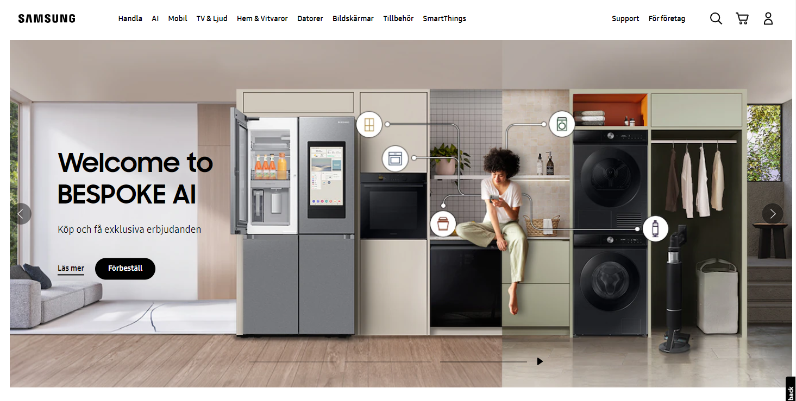
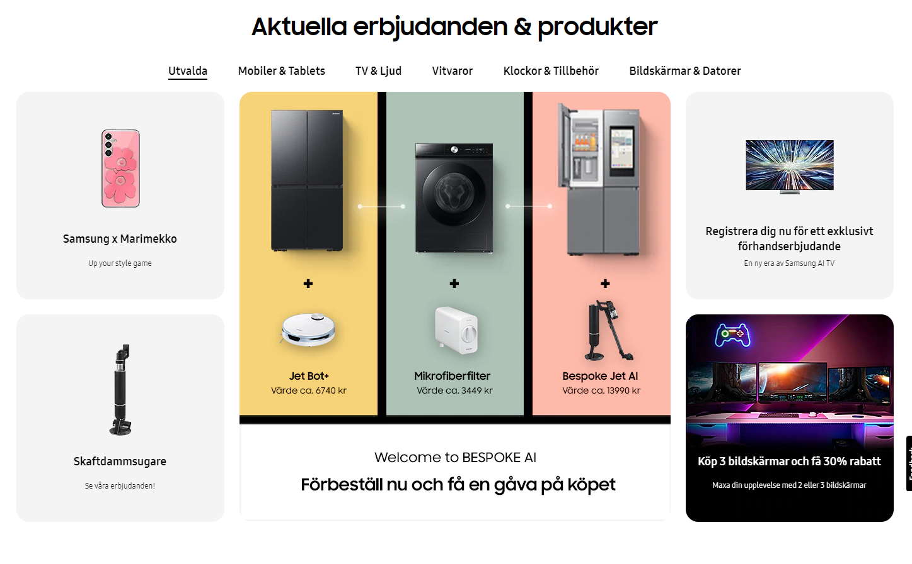

Jonas Hansén

Har valt att att återskapa http://www.samsung.com
De delar av sidan jag återskapat är headern, de två första content-sektionerna samt ett sökformulär längre ned på sidan. Valde att inte återskapa footern då jag tycker att de kunskaper som behövs för att återskapa den visas i de andra sektionerna jag återskapat. Hemsidan innehåller väldigt många sektioner med content, och jag tyckte att det räckte med att återskapa två av dom.

# Screenshots från originalhemsidan:
## Wide

## Slim

# Screenshots från min kopia:
## Wide

## Slim

Länk till github-repo: https://github.com/88jonhan/88jonhan-webbutveckling-uppgift1
